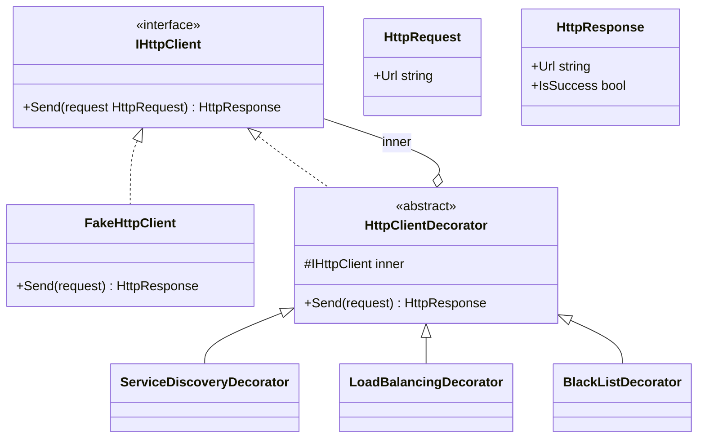

# HW7 — Decorator 模式 HttpClient 套件 實作計畫

> **狀態：Complete（2026-06-29）** — 套件三個 Decorator 與 Demo 皆完成，`dotnet build` 成功、
> `dotnet run` 輸出符合所有 Acceptance Criteria。

## Context

這是水球軟體設計學院 HW7「裝飾者模式 (Decorator Pattern)」作業。要實作一個可自由搭配機制的
HTTP Client 套件，支援三種可任意排列組合的加工機制：**服務探索 (Service Discovery)**、
**負載平衡 (Load Balancing / Round Robin)**、**黑名單 (Black List)**。

核心設計目標（取自 OOD 圖上的綠色註記）：
1. **每道加工行為各自繼承 Decorator** → 避免組合爆炸（不做 `ServiceAndLoadBalancing` 這種合併類別）。
2. **Client 可隨意更換每道行為的順序** → 任意排列組合都能跑。
3. **遵守 OCP** → 新增/移除機制不會動到其他 class；Client 可在不改套件碼下擴充自己的機制與 HttpClient 實作。

無需實作真正的 HTTP 協定，只需 `FakeHttpClient`（圖中的 `HttpServer`），把請求動作印到 Console
模擬，並可隨機決定成功（印 `[SUCCESS] <url>`）或失敗（拋例外）。

**本計畫範圍：只寫實作程式碼，不含測試。** 技術棧：C# / .NET 10。

> 設計取捨：OOD 圖示意上畫了 `ServiceAndLoadBalancing` 等合併類別，但圖上文字註記明確要求
> 「每道行為各自繼承 Decorator」。依使用者確認，採三個獨立 Decorator 的標準裝飾者寫法。

---

## Requirement (重述)

> 作為套件使用者，我要能用任意順序把「服務探索 / 負載平衡 / 黑名單」三種機制疊加在一個
> HTTP Client 上發出 GET 請求，並能在不修改套件碼的前提下擴充新機制或替換 Client 實作。

### Acceptance Criteria（行為描述，非自動化測試）

- **Given** 設定 `waterballsa.tw → 35.0.0.1, 35.0.0.2, 35.0.0.3` 且 `.1` 下線，**When** 連續對
  `http://waterballsa.tw/world` 發兩次請求（純服務探索），**Then** 第一次改寫成 `.1` 失敗並標記 `.1`
  失效 10 分鐘、第二次改寫成 `.2` 成功。
- **Given** 開啟服務探索 + 負載平衡，**When** 連續發 4 次請求，**Then** IP 依序輪流
  `.1 → .2 → .3 → .1`，且失效中的 IP 會被跳過。
- **Given** 開啟黑名單且 host 在黑名單中，**When** 發請求，**Then** 中止並拋例外。
- **Given** 任一排列組合（含空組合），**When** 發請求，**Then** 每個機制都用同一套 `Send` 邏輯運行。

---

## Architecture

### 類別圖（依 OOD 圖調整為三個獨立 Decorator）



### 設計重點

- **Component 介面 `IHttpClient`**：只有一個 `Send(HttpRequest)`。每個 decorator 對請求做加工
  （改寫 URL 或攔截），再委派給 `inner.Send(...)`，把結果往上回傳。這個單一窄介面是「任意排列」
  能成立的關鍵 —— 每層都是 `HttpRequest → HttpRequest → 委派 → HttpResponse`。
- **失效資訊往上回傳**：`FakeHttpClient` 失敗時拋例外。`ServiceDiscoveryDecorator` 包住委派呼叫，
  捕捉例外後把該 IP 標記失效 10 分鐘，再把例外重新拋出（行為符合「請求失敗則標記失效」）。
- **服務探索 vs 負載平衡的共用資料**：兩者都依賴 host→IP 序列與 IP 健康狀態，所以抽出共用協作者：
  - `ServiceRegistry`：host → IP 清單（從設定檔/字典載入）。
  - `IpHealthTracker`：記錄每個 IP 的失效到期時間（`now + 10min`），提供 `IsAlive(ip)` /
    `MarkFailed(ip)`。用 **可注入的時間來源** `Func<DateTime>`（預設 `() => DateTime.UtcNow`），
    方便日後驗證 10 分鐘恢復，但本計畫不寫測試。
- **服務探索**：拿請求 host，向 registry 查 IP 清單，挑「第一個 alive」的 IP，改寫 URL 後委派。
- **負載平衡**：對同一 host 維護 round-robin 游標，從 registry 的 alive IP 中輪流挑選，改寫 URL。
  - 排列差異（符合需求兩個範例）：放在服務探索之前時，LB 面對的候選只有原 host 一個（因為尚未展開
    成 IP），就維持原 URL；放在服務探索之後則對 IP 清單做輪流。實作上 LB 一律「對目前 request 的
    host 查 registry → 有多個 alive IP 就輪流改寫；查不到對應（已是 IP 或非註冊 host）就原樣放行」。
- **黑名單**：持有一組黑名單 host（逗號分隔字串解析）。檢查目前 request 的 URL host 是否命中，
  命中就拋 `BlackListedHostException`，否則委派。
- **OCP / 擴充性**：Client 端用建構式組裝
  `new BlackListDecorator(new LoadBalancingDecorator(new ServiceDiscoveryDecorator(new FakeHttpClient(...))))`。
  新增機制只要新增一個 `HttpClientDecorator` 子類；替換 Client 只要新增 `IHttpClient` 實作 —— 都不改套件碼。
- **Code Duplication < 3 行**：URL 解析（取 host / 換 host）集中在 `HttpUrl` 小工具，三個 decorator 共用。

### 專案結構

```
src/HttpClientKit/
  HttpClientKit.csproj
  IHttpClient.cs
  HttpRequest.cs
  HttpResponse.cs
  HttpUrl.cs                       (URL 解析/改寫工具，避免重複)
  FakeHttpClient.cs                (圖中的 HttpServer / 實際送出，模擬)
  Decorators/
    HttpClientDecorator.cs         (abstract base，持有 inner)
    ServiceDiscoveryDecorator.cs
    LoadBalancingDecorator.cs
    BlackListDecorator.cs
  Discovery/
    ServiceRegistry.cs             (host -> IP 清單)
    IpHealthTracker.cs             (IP 失效/10 分鐘恢復)
  Exceptions/
    BlackListedHostException.cs
    HttpRequestFailedException.cs
src/HttpClientKit.Demo/            (Console 範例，示範任意排列組合)
  HttpClientKit.Demo.csproj
  Program.cs
HttpClientKit.sln
```

---

## Implementation Steps

> 一律「先寫程式碼、再用 demo console 跑一次驗證」。不含單元測試。

### Phase 1 — 專案骨架
1. 建立 solution 與兩個專案：
   - `dotnet new sln -n HttpClientKit`（於 `d:\titan\Waterball\Decoractor`）
   - `dotnet new classlib -n HttpClientKit -o src/HttpClientKit -f net10.0`
   - `dotnet new console  -n HttpClientKit.Demo -o src/HttpClientKit.Demo -f net10.0`
   - `dotnet sln add src/HttpClientKit/HttpClientKit.csproj src/HttpClientKit.Demo/HttpClientKit.Demo.csproj`
   - `dotnet add src/HttpClientKit.Demo reference src/HttpClientKit/HttpClientKit.csproj`
   - 刪除模板產生的 `Class1.cs`。

### Phase 2 — 核心型別 (Component)
2. `HttpRequest.cs`：`public sealed record HttpRequest(string Url);`（只支援 GET，故無需 method）。
   提供 `WithUrl(string url)` 回傳新 record（不可變）。
3. `HttpResponse.cs`：`public sealed record HttpResponse(string Url, bool IsSuccess);`
4. `IHttpClient.cs`：`HttpResponse Send(HttpRequest request);`
5. `HttpUrl.cs`：靜態工具，集中 URL 操作避免重複：
   - `static string GetHost(string url)` — 解析 scheme 後的 host（用 `System.Uri`）。
   - `static string ReplaceHost(string url, string newHost)` — 換掉 host（保留 scheme/path）。
6. `Exceptions/HttpRequestFailedException.cs`、`Exceptions/BlackListedHostException.cs`
   （皆繼承 `Exception`，建構式帶 message）。

### Phase 3 — FakeHttpClient（實際送出 / 模擬）
7. `FakeHttpClient.cs` 實作 `IHttpClient`：
   - 建構式可注入 `Func<bool>? successDecider`（預設用 `Random` 隨機決定成功與否），
     方便 demo 控制結果。
   - `Send`：成功 → `Console.WriteLine($"[SUCCESS] {request.Url}")` 並回傳
     `new HttpResponse(request.Url, true)`；失敗 → `Console.WriteLine($"[FAILED] {request.Url}")`
     並 `throw new HttpRequestFailedException(request.Url)`。

### Phase 4 — 抽象 Decorator
8. `Decorators/HttpClientDecorator.cs`：`abstract class`，實作 `IHttpClient`，
   `protected readonly IHttpClient _inner;`，建構式注入 inner，提供
   `public abstract HttpResponse Send(HttpRequest request);`（或預設委派給 inner 的 virtual）。

### Phase 5 — 共用協作者 (服務探索 / 負載平衡 用)
9. `Discovery/ServiceRegistry.cs`：
   - 內部 `Dictionary<string, IReadOnlyList<string>>`（host → IP 清單）。
   - `Register(string host, params string[] ips)`、`bool TryGetIps(string host, out IReadOnlyList<string> ips)`。
   - 提供 `static ServiceRegistry FromConfig(string text)` 解析
     `waterballsa.tw: 35.0.0.1, 35.0.0.2, 35.0.0.3` 這種一行一 host 的設定字串（對應需求的「對照表配置檔」）。
10. `Discovery/IpHealthTracker.cs`：
    - `Dictionary<string, DateTime> _expireAt;`（IP → 失效到期時間）。
    - `Func<DateTime> _now`（建構式注入，預設 `() => DateTime.UtcNow`）。
    - `bool IsAlive(string ip)` — 無紀錄或已過期視為 alive；過期時順手清掉紀錄。
    - `void MarkFailed(string ip)` — 設 `_expireAt[ip] = _now() + TimeSpan.FromMinutes(10)`。

### Phase 6 — 三個獨立 Decorator  ✅ 完成 (2026-06-29)
> 實作 `ServiceDiscoveryDecorator.cs` / `LoadBalancingDecorator.cs` / `BlackListDecorator.cs`，
> `dotnet build src/HttpClientKit` 成功（0 warning, 0 error）。
> 偏離計畫：`BlackListDecorator` 的逗號字串 helper 命名為 `FromConfig`（靜態工廠），
> 黑名單 host 比對採 `StringComparer.OrdinalIgnoreCase`。其餘照計畫步驟 11–13。
11. `ServiceDiscoveryDecorator.cs`（建構式：inner, ServiceRegistry, IpHealthTracker）：
    - 取 `host = HttpUrl.GetHost(request.Url)`；`registry.TryGetIps(host)`。
    - 查不到 → 直接委派 `inner.Send(request)`。
    - 查得到 → 選「第一個 `tracker.IsAlive` 的 IP」；改寫 URL（`HttpUrl.ReplaceHost`）→
      `var chosenIp = ...;`，呼叫 `inner.Send(rewritten)`；
      用 `try/catch (HttpRequestFailedException)`：catch 時 `tracker.MarkFailed(chosenIp)` 後 `throw;`。
    - 全部 IP 失效 → 拋例外（或選最後一個，依需求預設行為；採「無 alive IP 則拋
      `HttpRequestFailedException`」）。
12. `LoadBalancingDecorator.cs`（建構式：inner, ServiceRegistry, IpHealthTracker）：
    - 取 host；`registry.TryGetIps(host)`。
    - 查不到（已是 IP / 非註冊 host）→ 委派原 request（對應排列在服務探索前、只有單一選項的情況）。
    - 查得到 → 從 alive IP 清單以 round-robin 游標（`Dictionary<string,int> _cursor` per host）
      取下一個 IP，改寫 URL 後委派。失效 IP 跳過。
13. `BlackListDecorator.cs`（建構式：inner, IEnumerable<string> blacklistHosts；
    另提供 `static` 由逗號字串解析的 helper）：
    - 取 `host = HttpUrl.GetHost(request.Url)`；命中黑名單 → `throw new BlackListedHostException(host)`；
      否則委派 `inner.Send(request)`。

### Phase 7 — Demo Console（驗證用）  ✅ 完成 (2026-06-29)
> 重寫 `Program.cs` 示範組合 A/B/C + 空組合，`dotnet run` 輸出符合 AC（見下方 Verification）。
> **設計決策（與使用者確認）**：原計畫把「選 IP/輪流」放 LB、「失敗標記失效」放服務探索，
> 兩者獨立。但當 LB 在外層先把 host 改寫成 IP 時，內層服務探索看到的已是 IP（不在 registry）
> 會略過，導致失敗標記不發生、失效 IP 無法被跳過。**改為：誰實際選出 IP 並送出，誰就在失敗時
> 標記該 IP 失效**——因此 `LoadBalancingDecorator` 在委派外加 `try/catch`，失敗時
> `tracker.MarkFailed(chosenIp)` 後 rethrow（與 `ServiceDiscoveryDecorator` 對稱）。
> 如此任意排列下，實際送出層都能正確標記失效並於下一輪跳過。
14. `HttpClientKit.Demo/Program.cs`：示範三種排列組合，印出鏈式行為：
    - 組合 A「服務探索 → 負載平衡 → 黑名單」：對 `http://waterballsa.tw/mail` 連發數次，
      用固定的 `successDecider` 讓 `.1` 必定失敗，展示失效跳過與輪流。
    - 組合 B「黑名單 → 負載平衡 → 服務探索」：展示同樣可運行但結果不同（LB 只有單一 host 選項）。
    - 組合 C：黑名單命中 → 拋 `BlackListedHostException`，印出被中止訊息。
    - 空組合：直接 `new FakeHttpClient(...)`。

---

## 不會做 (Out of Scope)
- 不實作真正的 HTTP 協定 / 真實網路。
- 不寫單元測試或測試專案（依使用者指示）。
- 不支援 POST/PUT 等其他 HTTP 方法。
- 不做設定檔的檔案 I/O 強制需求（`FromConfig` 吃字串即可；如需讀檔可由 Client 端自行讀入後傳字串）。

---

## Verification（手動，跑 demo）

```bash
cd "d:/titan/Waterball/Decoractor"
dotnet build HttpClientKit.sln          # 應成功，無編譯錯誤
dotnet run --project src/HttpClientKit.Demo
```

預期 Console 觀察點：
- 組合 A：看到 `[FAILED] http://35.0.0.1/...` 後接 `[SUCCESS] http://35.0.0.2/...`，
  且後續輪流到 `.3`、再回 `.2/.3`（`.1` 因失效被跳過）。
- 組合 B：URL 維持 `waterballsa.tw` 進入服務探索後才變成 `.1`，輸出與 A 不同。
- 組合 C：印出黑名單中止訊息（捕捉到 `BlackListedHostException`）。
- 任一排列都不會編譯/執行錯誤，且新增 decorator / 新 `IHttpClient` 實作都不需改既有套件碼。

## Risks & Mitigations
- **排列順序語意分歧**：服務探索與負載平衡都改寫 host，順序不同結果不同 —— 已在需求兩範例對齊
  （LB 對「目前可見的候選」運作；查不到 registry 對應就原樣放行）。
- **重複程式碼超過 3 行**：URL 解析/改寫集中於 `HttpUrl`，三個 decorator 共用，避免重複。
- **時間相關（10 分鐘）難驗證**：`IpHealthTracker` 用可注入的 `Func<DateTime>`，預設真實時間，
  日後要驗證恢復行為時可注入假時鐘。
